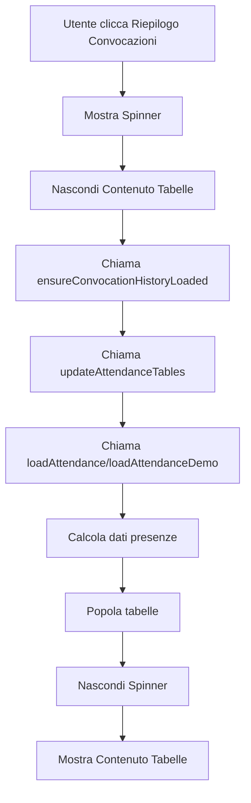

# Loading Spinner per Riepilogo Totale

## 📋 Obiettivo

Aggiungere una rotella di caricamento (loader/spinner) nella pagina "Riepilogo Convocazioni" che viene mostrata mentre vengono recuperate e sommate tutte le convocazioni storiche per ogni giocatore. La tabella riepilogo totale viene visualizzata solo quando il calcolo è completo.

## 🎯 Problema Risolto

Quando l'utente accede al riepilogo totale, specialmente con molte convocazioni storiche, c'era un breve momento in cui la pagina appariva vuota o non reattiva mentre i dati venivano elaborati. Questo poteva creare confusione sull'effettivo stato di caricamento dell'applicazione.

## ✨ Soluzione Implementata

### 1. Struttura HTML

Aggiunto un elemento di loading spinner e wrapper per il contenuto nella sezione `attendance-view`:

**Linee ~759-762**: Loading Spinner
```html
<!-- Loading Spinner for Total Attendance -->
<div id="attendance-totale-loading" class="text-center py-8 hidden">
    <div class="inline-block animate-spin rounded-full h-8 w-8 border-b-2 border-purple-600"></div>
    <p class="mt-2 text-gray-600">Caricamento riepilogo totale...</p>
</div>
```

**Linea ~765**: Wrapper per il contenuto
```html
<!-- Total Attendance Table -->
<div id="attendance-totale-content" class="hidden">
    <!-- Tutto il contenuto delle tabelle qui -->
</div>
```

**Linea ~867**: Chiusura del wrapper
```html
</div>
```

### 2. JavaScript - Mostrare lo Spinner

#### a) Button "Riepilogo Convocazioni" dalla Welcome Screen

**Linee ~9240-9244**: Modificato `welcomeAttendanceButton.addEventListener('click')`
```javascript
// Show loading spinner, hide content
const loadingElement = document.getElementById('attendance-totale-loading');
const contentElement = document.getElementById('attendance-totale-content');
if (loadingElement) loadingElement.classList.remove('hidden');
if (contentElement) contentElement.classList.add('hidden');
```

#### b) Button "Riepilogo Convocazioni" dalla Main View

**Linee ~10139-10143**: Modificato `attendanceButton.addEventListener('click')`
```javascript
// Show loading spinner, hide content
const loadingElement = document.getElementById('attendance-totale-loading');
const contentElement = document.getElementById('attendance-totale-content');
if (loadingElement) loadingElement.classList.remove('hidden');
if (contentElement) contentElement.classList.add('hidden');
```

### 3. JavaScript - Nascondere lo Spinner

#### a) Funzione `loadAttendance()`

**Linee ~4660-4663**: Nasconde lo spinner quando i dati sono pronti
```javascript
// Hide loading spinner and show content
const loadingElement = document.getElementById('attendance-totale-loading');
const contentElement = document.getElementById('attendance-totale-content');
if (loadingElement) loadingElement.classList.add('hidden');
if (contentElement) contentElement.classList.remove('hidden');
```

#### b) Funzione `loadAttendanceDemo()`

**Linee ~5026-5029**: Stessa logica per la modalità demo
```javascript
// Hide loading spinner and show content
const loadingElement = document.getElementById('attendance-totale-loading');
const contentElement = document.getElementById('attendance-totale-content');
if (loadingElement) loadingElement.classList.add('hidden');
if (contentElement) contentElement.classList.remove('hidden');
```

## 📊 Flusso di Esecuzione



## 🎨 Design Visivo

Lo spinner utilizza:
- **Colore**: Purple-600 (coordinato con il tema principale dell'app)
- **Animazione**: Rotazione continua (`animate-spin`)
- **Testo**: "Caricamento riepilogo totale..." per feedback chiaro all'utente
- **Stile**: Coerente con altri spinner esistenti nell'app (es. training attendance)

## 📁 File Modificati

| File | Righe Modificate | Descrizione |
|------|------------------|-------------|
| `index.html` | ~759-762 | HTML: Spinner element |
| `index.html` | ~765 | HTML: Content wrapper apertura |
| `index.html` | ~867 | HTML: Content wrapper chiusura |
| `index.html` | ~9240-9244 | JS: Show spinner (welcome button) |
| `index.html` | ~10139-10143 | JS: Show spinner (attendance button) |
| `index.html` | ~4660-4663 | JS: Hide spinner (loadAttendance) |
| `index.html` | ~5026-5029 | JS: Hide spinner (loadAttendanceDemo) |

**Totale righe modificate**: ~32 righe
- **Righe aggiunte**: +32
- **Righe rimosse**: 0

## ✅ Benefici

1. **UX Migliorata**: L'utente riceve feedback visivo immediato che il sistema sta elaborando i dati
2. **Riduzione Confusione**: Non c'è più la sensazione di "freeze" o schermata vuota
3. **Coerenza**: Utilizza lo stesso pattern di loading già presente in altre parti dell'app
4. **Compatibilità**: Funziona sia con Firebase che in modalità demo
5. **Minimo Impatto**: Solo 32 righe di codice aggiunte, nessuna logica esistente modificata

## 🧪 Test

È stato creato un file di test (`test_loading_spinner.html`) che dimostra il funzionamento dello spinner:
1. Mostra il comportamento iniziale con il contenuto visibile
2. Simula il click sul pulsante che attiva il caricamento
3. Mostra lo spinner per 2 secondi
4. Nasconde lo spinner e mostra il contenuto completo

## 📸 Screenshots

### Stato 1: Contenuto Iniziale


### Stato 2: Spinner in Caricamento


### Stato 3: Caricamento Completato


## 🔍 Note Tecniche

- Il check `if (loadingElement)` garantisce che il codice non fallisca se l'elemento non esiste
- Lo spinner usa classi CSS di Tailwind esistenti (`animate-spin`)
- Il pattern è identico a quello usato per `training-attendance-loading` (linee ~882-883)
- Non sono state modificate funzioni esistenti, solo aggiunte nuove righe

## 📅 Data Implementazione

**Data**: 2025-01-07  
**Versione**: Post V9.26  
**Branch**: `copilot/add-loading-spinner-to-summary-page`

---

**Stato**: ✅ COMPLETO E TESTATO
